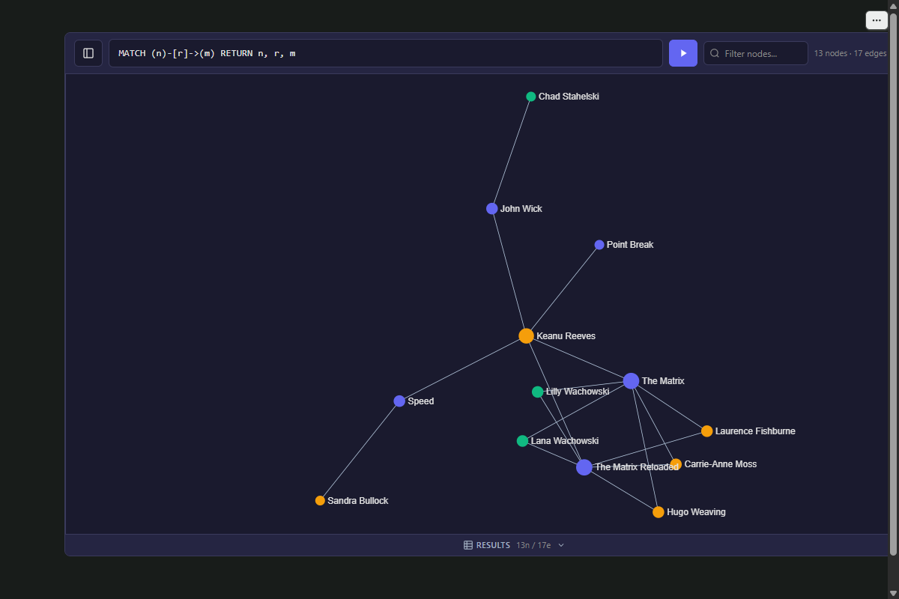

# anywidget-graph

Interactive graph visualization for Python notebooks.

Works with Marimo, Jupyter, VS Code, Colab, anywhere [anywidget](https://anywidget.dev/) runs.



## Features

- **Universal**: One widget, every notebook environment
- **Backend-agnostic**: Grafeo, Neo4j, NetworkX, pandas, or raw dicts
- **Interactive**: Pan, zoom, click, drag, pin, expand neighbors, box select
- **Customizable**: Colors, sizes, layouts, dark mode
- **Exportable**: HTML, JSON

## Installation

```bash
uv add anywidget-graph
```

Optional extras:

```bash
uv add "anywidget-graph[networkx]"   # NetworkX support
uv add "anywidget-graph[pandas]"     # pandas support
uv add "anywidget-graph[grafeo]"     # Grafeo backend
uv add "anywidget-graph[cosmosdb]"   # CosmosDB / Gremlin support
```

## Quick Start

```python
from anywidget_graph import Graph

graph = Graph.from_dict(
    {
        "nodes": [
            {"id": "alice", "label": "Alice", "group": "person"},
            {"id": "bob", "label": "Bob", "group": "person"},
            {"id": "paper", "label": "Graph Theory", "group": "document"},
        ],
        "edges": [
            {"source": "alice", "target": "bob", "label": "knows"},
            {"source": "alice", "target": "paper", "label": "authored"},
        ],
    }
)

graph
```

## Data Sources

### Dictionary

```python
graph = Graph.from_dict({"nodes": [{"id": "a"}, {"id": "b"}], "edges": [{"source": "a", "target": "b"}]})
```

### Direct initialization

```python
graph = Graph(
    nodes=[{"id": "a", "label": "Alice"}, {"id": "b", "label": "Bob"}],
    edges=[{"source": "a", "target": "b", "label": "KNOWS"}],
)
```

### Cypher results (Neo4j)

```python
from neo4j import GraphDatabase

driver = GraphDatabase.driver("bolt://localhost:7687", auth=("neo4j", "password"))

with driver.session() as session:
    result = session.run("MATCH (a)-[r]->(b) RETURN a, r, b LIMIT 100")
    graph = Graph.from_cypher(result)
```

### GQL results

```python
graph = Graph.from_gql(result)
```

### SPARQL results

```python
from rdflib import Graph as RDFGraph

g = RDFGraph()
g.parse("data.ttl")
result = g.query("SELECT ?s ?p ?o WHERE { ?s ?p ?o }")
graph = Graph.from_sparql(result)
```

### Gremlin results (CosmosDB, TinkerPop)

```python
graph = Graph.from_gremlin(result)
```

### GraphQL results

```python
graph = Graph.from_graphql(
    response.json(),
    nodes_path="data.characters.results",
    id_field="id",
    label_field="name",
)
```

### NetworkX

```python
import networkx as nx

G = nx.karate_club_graph()
graph = Graph.from_networkx(G)
```

### pandas DataFrames

```python
import pandas as pd

nodes_df = pd.DataFrame({"id": ["alice", "bob"], "group": ["person", "person"]})
edges_df = pd.DataFrame({"source": ["alice"], "target": ["bob"], "weight": [1.0]})

graph = Graph.from_dataframe(nodes_df, edges_df)
```

## Interactivity

### Events

```python
graph = Graph.from_dict(data)


@graph.on_node_click
def handle_node(node_id, node_data):
    print(f"Clicked: {node_id}")


@graph.on_edge_click
def handle_edge(edge_data):
    print(f"Edge: {edge_data['label']}")


@graph.on_selection
def handle_selection(node_ids):
    print(f"Selected: {node_ids}")
```

### Selection

```python
graph.selected_nodes  # Current selection (list of IDs)
graph.selection_mode = "box"  # Switch to box-select mode
```

### Node expansion

```python
graph.expand_node("alice")  # Fetch and merge neighbors (requires backend)
```

### Node pinning

```python
graph.pin_nodes(["alice", "bob"])  # Pin at current positions
graph.unpin_nodes(["alice"])  # Release back to layout
graph.toggle_pin("bob")  # Toggle pin state
graph.unpin_all()  # Unpin everything
```

### Clear

```python
graph.clear()  # Remove all nodes, edges, pins, and selection
```

### Linked lanes and live append

Show two graphs side by side in one canvas, each laid out in its own lane, with curved edges between them, and grow them while a process runs:

```python
graph = Graph(
    lanes=[{"id": "source", "title": "Source graph"}, {"id": "target", "title": "Target graph"}],
    nodes=[{"id": "a", "lane": "source"}, {"id": "b", "lane": "source"}, {"id": "x", "lane": "target"}],
    edges=[{"source": "a", "target": "b"}, {"source": "x", "target": "a", "cross": True}],
)
graph.append(nodes=[{"id": "y", "lane": "target"}], edges=[{"source": "y", "target": "b"}])
graph.remove(nodes=["x"])  # fades out, nothing else moves
graph.pulse_nodes = ["b"]  # a soft pulse on these nodes; [] stops it
graph.theme = {
    "background": "#0d1416",
    "panel": "#121b1e",
    "text": "#dbe7e5",
    "muted": "#8ea3a3",
    "border": "#1e2b2f",
    "accent": "#5bb8a9",
}
```

- `lanes`: lanes left to right; a node's `lane` picks one (a node without a known lane goes to the first). Edges between lanes (or marked `cross`) are drawn as soft curves above both lanes and light up when either end is hovered or selected; a search also shows a match's partners in the other lanes. Without `lanes` the widget behaves as before.
- `append(nodes, edges)`: adds items without a re-layout; existing nodes keep their positions, a new node is placed at the height of its neighbours in other lanes, where nodes of the same neighbours stack as rows one label line apart with their labels shown (or next to its neighbours in its lane; without lanes, next to its neighbours inside the area already drawn). The items are also merged into `nodes` and `edges`, so `to_json()`, `to_html()` and a widget shown again include them (a host that sets `append_batch` itself gets the merged lists written back by the widget). Changing `lanes` or a style keeps appended items; setting `nodes` or `edges` to other data replaces everything drawn. New items fade in and edges draw from source to target, `append_stagger_ms` (default 60) apart; a large batch is kept under 1.5 s. `append_animation="none"` turns the animation off.
- `remove(nodes, edges)`: takes nodes (with every edge touching them) and edges out without a re-layout; they fade out and leave `nodes` and `edges`. An edge is `{"source", "target"}` (every edge between those ends) or with a `"label"` (that edge only). A host that sets `append_batch` itself puts them under `remove`: `{"seq": n, "nodes": [...], "edges": [...], "remove": {"nodes": [ids], "edges": [...]}}`; removals come first, so one batch can re-sample (an item removed and sent again stays where it is).
- Lane options: `width` is a lane's share of the standard width (default 1); `arrange: "column"` stacks the lane's nodes in the middle of its band (for a few roots, such as repositories, whose edges then fan out into the next lane); `action: True` makes a lane without nodes that shows a button, with the host's `icon` (SVG markup, where `currentColor` takes the accent colour, or an image URL), or `glyph` (a list of colours drawn as stacked bars), else a neutral "open" icon; `caption` is text under it. An edge whose end is an action lane's id (and no node) is drawn as a curve into its button, like the cross-lane curves. The camera frames all lanes, and the lanes stretch to the canvas's shape.
- Lane layout options (all off by default; a lane without them is laid out as before):
  - `layout: "force"`: a force layout inside the lane: nodes repel and do not overlap, edges inside the lane are springs, and a node is pulled towards the height of its partners in the lanes to its left. Nodes never leave their lane. A crowded lane draws its nodes smaller so the layout has room. Appended nodes settle from where they land while the older nodes stay put. Deterministic: the same data gives the same picture.
  - `rows: {"field": "layer", "order": ["business", "application", "technology"]}`: splits the lane into rows, top to bottom, by a node field; a node with another value (or none) goes to an extra row at the bottom. Row heights follow the node counts (with a minimum), each row shows its name and a faint separator, and nodes stay inside their row. Implies `layout: "force"`.
  - `labels: {"count": 12}`: at the default zoom, shows the labels of the lane's 12 largest nodes (by size, then degree), and no others (hover or select a node to see its label; zoomed in or out, sigma's label grid decides). A label may cover smaller nodes, on a soft backing so it stays readable, but never a node as large, a labelled node or another label; one that would cross the lane's right edge goes on the left of its node, and a long name is shortened with an ellipsis (hover shows it whole).
  - `relayout: 0.33`: when one batch removes or adds more than this share of the lane's nodes (a re-sample), the lane is laid out again as a whole and its nodes glide to their new places; smaller batches keep older nodes where they are.
- `lane_action`: set to `{"lane": <id>, "seq": <n>}` when an action lane's glyph is clicked, so the host can respond (open a panel, switch a view). `seq` counts on from the value the model holds, so every click is a change, also in a widget shown twice.
- `pulse_nodes`: ids that pulse softly.
- `type_colors`: colours per type, `{"nodes": {"<type>": "#hex"}, "edges": {"<type>": "#hex"}}` (types as the schema panel groups them). They colour the items of that type and the legend swatches; an item's own `color` still wins, and other types keep the palette.
- `totals`: for a host that sends a sample of a larger graph, `{"nodes": {"<type>": n}, "edges": {"<type>": n}}` (types as the schema panel groups them: a node's first label, an edge's type). The count badge and the schema panel show "shown / total"; a type the sample lacks shows as 0, a type without a total shows its count (and counts as shown in full).
- `theme`: host colours (`background`, `panel`, `text`, `muted`, `border`, `accent`) that replace the widget's light and dark defaults; a key left out (or `theme = {}`) brings the default back.
- `_features`: the widget sets the capabilities it supports when it renders, so a host can detect an older build.

## Styling

### Property-based coloring

```python
graph = Graph.from_dict(
    data,
    color_field="group",  # Color nodes by field
    color_scale="viridis",  # Scale: viridis, plasma, inferno, magma, cividis, turbo
    size_field="score",  # Size nodes by field
    size_range=[5, 30],  # Min/max node size
)
```

### Edge styling

```python
graph.edge_color_field = "type"
graph.edge_color_scale = "plasma"
graph.edge_size_field = "weight"
graph.edge_size_range = [1, 8]
```

### Layouts

```python
Graph.from_dict(data, layout="force")  # ForceAtlas2 (default)
Graph.from_dict(data, layout="circular")
Graph.from_dict(data, layout="random")
```

## Options

```python
graph = Graph(
    nodes=nodes,
    edges=edges,
    width=800,  # Widget width (px)
    height=600,  # Widget height (px)
    fill=False,  # Take the host's size and follow resizes (ignores width/height)
    background="#fafafa",  # Background color
    show_labels=True,  # Node labels
    show_edge_labels=False,  # Edge labels
    show_toolbar=True,  # Toolbar visibility
    show_settings=True,  # Settings panel
    show_query_input=True,  # Query input box
    dark_mode=True,  # Dark theme
    show_tooltip=True,  # Hover tooltips
    tooltip_fields=["label", "id"],
    max_nodes=300,  # Limit for node expansion
)
```

## Database Backends

### Grafeo (default)

Grafeo runs in one of three modes, picked with `grafeo_connection_mode` or in the settings panel.

**Embedded** (Python, the default): queries run in the notebook kernel. Requires the `grafeo` extra (`grafeo>=0.5.44,<0.7`).

```python
import grafeo

db = grafeo.GrafeoDB()
graph = Graph(database_backend="grafeo", grafeo_db=db, query_language="gql")
```

**Server**: the browser talks to [grafeo-server](https://github.com/GrafeoDB/grafeo-server) over HTTP (`POST /query`, `GET /db/{name}/schema`). The server must allow the notebook's origin, for example `grafeo-server --cors-origins http://localhost:8888`.

```python
graph = Graph(database_backend="grafeo", grafeo_connection_mode="server", grafeo_server_url="http://localhost:7474")
```

**WASM**: the engine runs in the browser. `@grafeo-db/wasm` (0.5.44) is downloaded from jsDelivr when you click "Initialize WASM", so nothing extra is installed in Python.

```python
graph = Graph(database_backend="grafeo", grafeo_connection_mode="wasm", query_language="gql")
```

Query languages: GQL, Cypher, Gremlin, GraphQL and SPARQL. Nodes and edges are taken from every result column, including lists (`collect(n)`, variable-length relationships, `nodes(p)`) and paths (`RETURN p`); scalar columns are ignored. Run one statement per query: Grafeo rejects several `;`-separated statements in one call.

Try it without any setup:

```python
from anywidget_graph.demo import demo_graph

demo_graph()  # WASM mode with a small movie graph loaded
```

### Neo4j (browser-side)

```python
graph = Graph(
    database_backend="neo4j",
    connection_uri="neo4j+s://demo.neo4jlabs.com",
    connection_username="neo4j",
    connection_password="password",
)
```

### Generic backend

```python
graph = Graph(backend=my_backend)  # Any object implementing DatabaseBackend protocol
```

## Embedding in an app

The widget knows graphs, not your domain. The host (a notebook, or an app that mounts the widget's front end) decides how its data looks and behaves, and the widget's own defaults stay neutral:

- **Looks**: colours per type (`type_colors`), the host's colours (`theme`), action lane icons (`icon`, `glyph`), lane titles and captions.
- **What to show**: when a graph is too large to draw whole, the host picks the sample and sends it, with the totals behind it (`totals`); the widget never makes counts up. `append()` and `remove()` keep the drawing up to date without a re-layout.
- **Layout per lane**: `width`, `arrange`, `layout`, `rows`, `relayout` and `labels` are lane options the host sets.

New behaviour is opt-in and off by default: an update does not change a view that does not ask for it. `_features` lists what a build supports, so a host can tell an older build apart and fall back.

### Without Python

An app can mount the bundled front end (`anywidget_graph.ui.get_esm()` and `get_css()`) with any model object that has `get`, `set`, `on`, `off`, `save_changes` and `send`, as anywidget's model does.

- The host sets `nodes`, `edges`, `lanes`, `append_batch`, `pulse_nodes`, `theme`, `type_colors`, `totals`, `dark_mode`, and the size (`width` and `height`, or `fill`).
- The widget sets `selected_node`, `selected_nodes`, `selected_edge`, `hovered_node`, `lane_action` and `_features`. After an `append_batch` it writes the merged `nodes` and `edges` back, unless they already hold the batch (as `Graph.append()` sends them).
- A setting the host leaves out reads as the widget's default, the same as a fresh Python `Graph()` has it.
- The widget sends no query when it mounts: the first view is the host's.

## Export

```python
graph.to_json()  # JSON string with nodes and edges
graph.to_html()  # Self-contained HTML string
graph.to_html(title="My Graph")  # Custom title
graph.save_html("graph.html")  # Write HTML to file
```

## Environment Support

| Environment | Supported |
|-------------|-----------|
| Marimo | Yes |
| JupyterLab | Yes |
| Jupyter Notebook | Yes |
| VS Code | Yes |
| Google Colab | Yes |
| Databricks | Yes |

## Related

- [anywidget](https://anywidget.dev/), custom Jupyter widgets made easy
- [Grafeo](https://github.com/GrafeoDB/grafeo), embeddable graph database
- [grafeo-web](https://github.com/GrafeoDB/grafeo-web), Grafeo in the browser
- [Playground](https://grafeo.ai), interactive browser playground for Grafeo

## License

Apache-2.0
